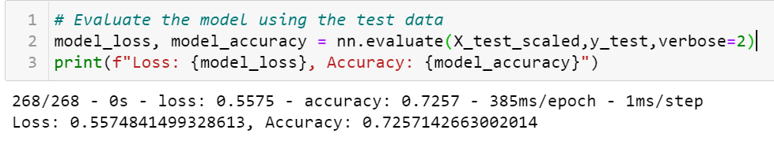

# Neural_Network_Charity_Analysis

## Overview of the analysis:
The purpose of this project is to create a model using deep-learning neural networks with the TensorFlow platform in Python, to predict what organizations would receive funding from Alphabet Soup with a targeted accuracy of at least 75% using the historical dataset [charity_data.csv](Resources/charity_data.csv).

## Deliverables for the Project
- Deliverable 1: Preprocessing Data for a Neural Network Model
- Deliverable 2: Compile, Train, and Evaluate the Model
- Deliverable 3: Optimize the Model

## Results:

### Data Prepocessing:
- What variable(s) are considered the target(s) for your model?
  Variable that was considered as the target for my model: IS_SUCCESSFUL column, which indicates whether the money was used effectively.
- What variable(s) are considered to be the features for your model?
  The features for our model are APPLICATION_TYPE, AFFILIATION, CLASSIFICATION, USE_CASE, ORGANIZATION, STATUS, INCOME_AMT, SPECIAL_CONSIDERATIONS, ASK_AMT columns.
- What variable(s) are neither targets nor features, and should be removed from the input data?
  Variable that were neither targets or features for the dataset: Columns that I dropeed are EIN, NAME because they will have little to no impact on the outcome

### Compiling, Training, and Evaluating the Model
- How many neurons, layers, and activation functions did you select for your neural network model, and why?
  For my neural network model I had 2 hidden layers. First layer had 80 neurons, the second has 30 neurons. The first and second hidden layer have the "relu" activation function as it is good at dealing with complex dataset with numerous features and efficient with time and the output layer has "sigmoid" as activation function as the output is a binary classification.

  
  
- Were you able to achieve the target model performance?
  No, I was not able to achieve the target model performance.

  

- What steps did you take to try and increase model performance?
  I tried four different optimizations.
  
  - Optimization 1: Removing addition feature from the data set
        I removed the "USE_CASE" column and ran the neural network model above. This resulted in a very small improvement in performance. So, I am keeping the same data for next optimization.
        
        
    Optimization 1 Model:
        
    
    Optimization 1 Model's Evaluation Results:
    

  - Optimization 2: Adding more neurons to the hidden layers
        As there was a positive impact on the performance I decided to keep the same data set and change the neural network model by adding more neurons to both the hidden layers. This resulted in a drop in performance when compared to first optimization model. Hence I reset the neurons to previous values for both the hidden layers for next optimization.

    Optimization 2 Model:
        

    Optimization 2 Model's Evaluation Results:
        

  - Optimization 3: Adding an additional hidden layer
        As there was negative impact to the performance when I added additional neurons to the hidden layers, I decided to reset the values back to neural network model and added an additional hidden layer with 10 neurons and used "relu" as activation function. This resulted in a drop in performance when compared to first optimization model. Hence, I removed the additional hidden layer for next optimization.

    Optimization 3 Model:
        

    Optimization 3 Model's Evaluation Results:
        

  - Optimization 4: Changing activation function.
        As additional hidden layer negatively impacted the performance I decided to remove the third hidden layer and change the activation function for second hidden layer to "tanh". This resulted in a positive impact on the performance when compared to first optimization model. But, it did not reach the desired target of 75% accuracy.

    Optimization 4 Model:
        

    Optimization 4 Model's Evaluation Results:
        

## Summary:
The initial neural network model and all my optimization models failed to achieve the target accuracy of 75%. Since we are in a binary classification situation, we could use a supervised machine learning model such as the Random Forest Classifier. By combining multiple weak learners, Random Forest Classifier behaves similarly to neural networks. Random forest can be robust and accurate model if there are sufficient number of estimators and tree depth. Also the random forest models have a faster performance than neural networks and avoids the data from being overfitted.

## Resources:
- Dataset: [charity_data.csv](Resources/charity_data.csv)
- Technologies used:
  - Python
  - Pandas
  - SKLearn
  - Tensorflow
  - Jupyter Notebook
  - Neural Networks and Deep Machine Learning